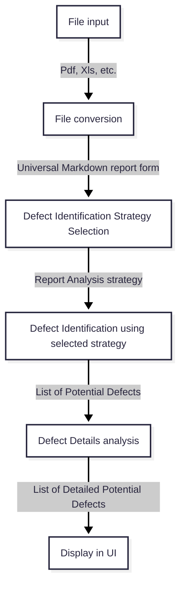

# Defect Analyzer Architecture

This file is meant to describe how each part in the defect analyzer works and how these parts cooperate.

## Data flow

Let's examine all of the steps taken by our software.

### File input

User in UI has a possibility to input a file, we expect a Pdf, Xls or any kind of format from handled report formats.

User should be able to input multiple documents

### File conversion

Based on the input format of the file and its metadata, we select a method of conversion. 

Conversion stage should extract as much data as possible from the input document. Ideally, all the data contained within the report should be extracted.

Conversion result is a text represented in a **markdown format**.

### Defect Identification Strategy Selection

First, we should define a **report type** as a **certain way of describing defect information and other significant data about the defects within the report**.

Defect Identification is done differently for different report types. This step is meant to analyze the contents of the report produced in previous step and based on that select an appropriate analysis strategy.

The component responsible for strategy selection is a [selection engine](DefectIdentificationSelectionEngine.md).

Selection result is one selected strategy.

### Report Analysis using selected strategy

Report analysis involves a certain use of chunking, LLM prompting and any kind of different logic dedicated for handling given report type. 

The report analysis strategies should not depend strictly on report's structure and should consider possible lack of data. As the software requires
flexible report handling, ideally strategies should consider e.g. report structure anomalies or varying data presence.

The result of report analysis is a list of [Potential Defects](Domain.md#potential-defect).

### Potential Defect Detail analysis

Depending on the Report Analysis strategy we may proceed with the potential defect list and for each defect analyze the report once again to get additional details for each defect.

Each report analysis strategy may optionally have a defect detail analysis strategy, if applicable.  

Result of defect detail analysis is a list of [Detailed Potential Defects](Domain.md#detailed-potential-defect) 

### User Interface

Last step of the flow is to display the list of Detailed Potential Defects list in the frontend.

For now let's do a grid table in a dropdown form where Detail fields are in a dropdown body.